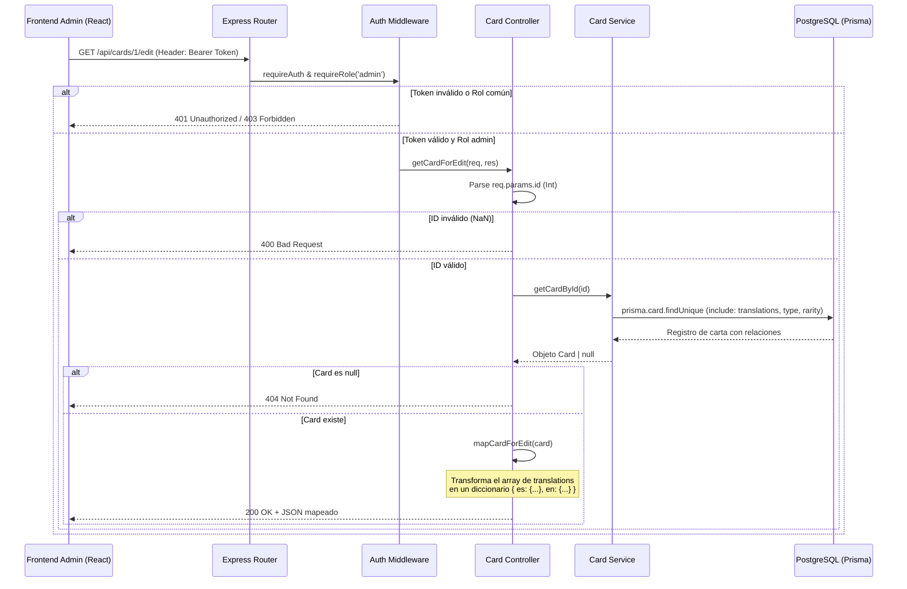

# Diseño Técnico: us-19-card-edit (Endpoint de Consulta Completa de Carta para Edición)

## 1. Contrato del Endpoint API
- **Ruta:** `GET /api/cards/:id/edit`
- **Seguridad:** Requiere cabecera `Authorization: Bearer <token>`
- **Restricciones:** El token JWT debe pertenecer a un usuario con rol `admin`.
- **Respuestas:**
  - **`200 OK`**: Retorna el objeto de la carta formateado con traducciones indexadas en un diccionario.
  - **`400 Bad Request`**: ID de carta inválido o no numérico.
  - **`401 Unauthorized`**: Token JWT ausente, expirado o malformado.
  - **`403 Forbidden`**: Token válido pero el usuario no tiene permisos de administrador.
  - **`404 Not Found`**: El ID de la carta no existe en la base de datos de Prisma.

## 2. Diagrama de Secuencia Conceptual


## 3. Especificación de Componentes e Implementación

### A. Rutas (`src/routes/card.routes.js`)
Se registrará la nueva ruta e importará la función controladora `getCardForEdit`:
```javascript
import { ..., getCardForEdit } from '../controllers/card.controller.js';
...
router.get('/cards/:id/edit', requireAuth, requireRole(ROLES.ADMIN), getCardForEdit);
```

### B. Helper de Mapeo en el Controlador
Para estructurar los datos del modelo relacional de base de datos al formato requerido por la UI, implementaremos la función utilitaria `mapCardForEdit(card)` en `src/utils/i18n.js` (o directamente como helper en el controlador):
```javascript
export function mapCardForEdit(card) {
  const translations = {};
  
  card.translations.forEach(t => {
    translations[t.language] = {
      name: t.name,
      description: t.description
    };
  });

  return {
    id: card.id,
    cost: card.cost,
    atk: card.atk,
    def: card.def,
    image: card.image,
    typeCode: card.type?.code || '',
    rarityCode: card.rarity?.code || '',
    translations
  };
}
```

### C. Controlador (`src/controllers/card.controller.js`)
Se definirá el Handler `getCardForEdit`:
```javascript
export async function getCardForEdit(req, res, next) {
  try {
    const id = parseInt(req.params.id, 10);
    const lang = getLanguage(req);

    if (isNaN(id)) {
      return res.status(400).json({
        error: translate(ERROR_KEYS.INVALID_DATA, lang),
        details: [{ field: 'id', message: translate(ERROR_KEYS.INVALID_CARD_ID, lang) }]
      });
    }

    const card = await cardService.getCardById(id);

    if (!card) {
      const err = translate(ERROR_KEYS.CARD_NOT_FOUND, lang);
      return res.status(404).json({
        error: err.error,
        message: err.message
      });
    }

    const formattedCard = mapCardForEdit(card);
    res.status(200).json(formattedCard);
  } catch (error) {
    next(error);
  }
}
```

## 4. Estrategia de Pruebas Unitarias y de Integración
- **Archivo de Pruebas:** `tests/card.controller.test.js`
- **Casos de Test:**
  - `describe("GET /api/cards/:id/edit", ...)`
    - Debe retornar 401 si no se envía la cabecera Authorization.
    - Debe retornar 403 si el usuario tiene rol `usuario`.
    - Debe retornar 400 si el ID no es numérico.
    - Debe retornar 404 si el ID no existe en la base de datos.
    - Debe retornar 200 y el JSON estructurado (con diccionario de traducciones, `typeCode` y `rarityCode`) si el usuario es admin y el ID existe.
